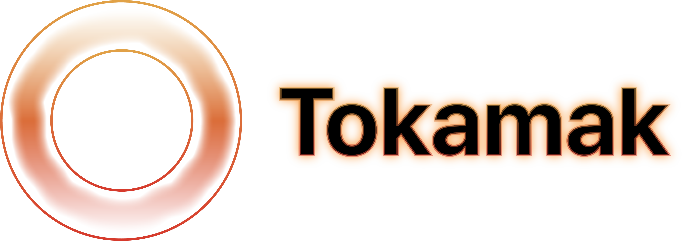

## SwiftUI-compatible framework for building browser apps with WebAssembly

[](https://github.com/TokamakUI/Tokamak/actions?query=workflow%3ACI) [](https://discord.gg/ashJW8T8yp)

At the moment Tokamak implements a very basic subset of SwiftUI. Its DOM renderer supports a few
view types and modifiers (you can check the current list in [the progress
document](docs/progress.md)), and a new `HTML` view for constructing arbitrary HTML. The long-term
goal of Tokamak is to implement as much of SwiftUI API as possible and to provide a few more helpful
additions that simplify HTML and CSS interactions.

If there's some SwiftUI API that's missing but you'd like to use it, please review the existing
[issues](https://github.com/swiftwasm/Tokamak/issues) and
[PRs](https://github.com/swiftwasm/Tokamak/pulls) to get more details about the current status, or
[create a new issue](https://github.com/swiftwasm/Tokamak/issues/new) to let us prioritize the
development based on the demand. We also try to make the development of views and modifiers easier
(with the help from the `HTML` view, see [the example
below](https://github.com/swiftwasm/Tokamak#arbitrary-html)), so pull requests are very welcome!
Don't forget to check [the "Contributing"
section](https://github.com/swiftwasm/Tokamak#contributing) first.

If you'd like to participate in the growing [SwiftWasm](https://swiftwasm.org) community, you're
also very welcome to join [our Discord server](https://discord.gg/ashJW8T8yp), or the `#webassembly`
channel in [the SwiftPM Slack](https://swift-package-manager.herokuapp.com/).

### Example code

Tokamak API attempts to resemble SwiftUI API as much as possible. The main difference is
that you use `import TokamakShim` instead of `import SwiftUI` in your files. The former makes
your views compatible with Apple platforms, as well as platforms supported by Tokamak (currently
only WebAssembly/[WASI](https://wasi.dev/) with more coming in the future):

```swift
import TokamakShim

struct Counter: View {
  @State var count: Int
  let limit: Int

  var body: some View {
    if count < limit {
      VStack {
        Button("Increment") { count += 1 }
        Text("\(count)")
      }
      .onAppear { print("Counter.VStack onAppear") }
      .onDisappear { print("Counter.VStack onDisappear") }
    } else {
      VStack { Text("Limit exceeded") }
    }
  }
}

struct CounterApp: App {
  var body: some Scene {
    WindowGroup("Counter Demo") {
      Counter(count: 5, limit: 15)
    }
  }
}

// @main attribute is not supported in SwiftPM apps.
// See https://bugs.swift.org/browse/SR-12683 for more details.
CounterApp.main()
```

### Arbitrary HTML

With the `HTML` view you can also render any HTML you want, including inline SVG:

```swift
struct SVGCircle: View {
  var body: some View {
    HTML("svg", ["width": "100", "height": "100"]) {
      HTML("circle", [
        "cx": "50", "cy": "50", "r": "40",
        "stroke": "green", "stroke-width": "4", "fill": "yellow",
      ])
    }
  }
}
```

`HTML` doesn't support event listeners, and is declared in the `TokamakStaticHTML` module, which `TokamakDOM` re-exports. The benefit of `HTML` is that you can use it for static rendering in libraries like [TokamakVapor](https://github.com/TokamakUI/TokamakVapor) and [TokamakPublish](https://github.com/TokamakUI/TokamakPublish).

Another option is the `DynamicHTML` view provided by the `TokamakDOM` module, which has a `listeners` property with a corresponding initializer parameter. You can pass closures that can handle `onclick`, `onmouseover` and other DOM events for you in the `listeners` dictionary. Check out [MDN docs](https://developer.mozilla.org/en-US/docs/Web/API/GlobalEventHandlers) for the full list.

### Arbitrary styles and scripts

While [`JavaScriptKit`](https://github.com/swiftwasm/JavaScriptKit) is a great option for occasional interactions with JavaScript,
sometimes you need to inject arbitrary scripts or styles, which can be done through direct
DOM access:

```swift
import JavaScriptKit

let document = JSObject.global.document
let script = document.createElement("script")
script.setAttribute("src", "https://cdnjs.cloudflare.com/ajax/libs/moment.js/2.27.0/moment.min.js")
document.head.appendChild(script)

_ = document.head.insertAdjacentHTML("beforeend", #"""
<link
  rel="stylesheet"
  href="https://cdnjs.cloudflare.com/ajax/libs/semantic-ui/2.4.1/semantic.min.css">
"""#)
```

This way both [Semantic UI](https://semantic-ui.com/) styles and [moment.js](https://momentjs.com/)
localized date formatting (or any arbitrary style/script/font added that way) are available in your
app.

## Requirements for app developers

- macOS 11 and Xcode 12.5. Xcode 13 is currently not supported.
- [Swift 5.4 or later](https://swift.org/download/) and Ubuntu 18.04 if you'd like to use Linux.
  Other Linux distributions are currently not supported.

## Requirements for app users

Any browser that [supports WebAssembly](https://caniuse.com/#feat=wasm) should work, which currently includes:

- Edge 16+
- Firefox 61+
- Chrome 66+
- (Mobile) Safari 12+

Not all of these were tested though, compatibility reports are very welcome!

## Getting started

Tokamak relies on [`carton`](https://carton.dev) as a primary build tool. As a part of these steps
you'll install `carton` via [Homebrew](https://brew.sh/) on macOS (unfortunately you'll have to build
it manually on Linux). Assuming you already have Homebrew installed, you can create a new Tokamak
app by following these steps:

1. Install `carton`:

```
brew install swiftwasm/tap/carton
```

If you had `carton` installed before this, make sure you have version 0.11.0 or greater:

```
carton --version
```

2. Create a directory for your project and make it current:

```
mkdir TokamakApp && cd TokamakApp
```

3. Initialize the project from a template with `carton`:

```
carton init --template tokamak
```

4. Build the project and start the development server, `carton dev` can be kept running
   during development:

```
carton dev
```

5. Open [http://127.0.0.1:8080/](http://127.0.0.1:8080/) in your browser to see the app
   running. You can edit the app source code in your favorite editor and save it, `carton`
   will immediately rebuild the app and reload all browser tabs that have the app open.

You can also clone this repository and run `carton dev --product TokamakDemo` in its root
directory. This will build the demo app that shows almost all of the currently implemented APIs.

## Security

By default, the DOM renderer will escape HTML control characters in `Text` views. If you wish
to override this functionality, you can use the `_domTextSanitizer` modifier:

```swift
Text("<font color='red'>Unsanitized Text</font>")
  ._domTextSanitizer(Sanitizers.HTML.insecure)
```

You can also use custom sanitizers; the argument to `_domTextSanitizer` is simply a
`String -> String` closure. If `_domTextSanitizer` is applied to a non-`Text` view,
it will apply to all `Text` in subviews, unless overridden.

If you use user-generated or otherwise unsafe strings elsewhere, make sure to properly
sanitize them yourself.

## Troubleshooting

### `unable to find utility "xctest"` error when building

This error can only happen on macOS, so make sure you have Xcode installed as listed [in the
requirements](#requirements-for-app-developers). If you do have Xcode installed but still get the
error, please refer to [this StackOverflow answer](https://stackoverflow.com/a/61725799/442427).

### Syntax highlighting and autocomplete don't work in Xcode

Open `Package.swift` of your project that depends on Tokamak with Xcode and build it for macOS.
As Xcode currently doesn't support cross-compilation for non-Apple platforms, your project can't
be indexed if it doesn't build for macOS, even if it isn't fully function on macOS when running.
If you need to exclude some WebAssembly-specific code in your own app that doesn't compile on macOS,
you can rely on `#if os(WASI)` compiler directives.

All relevant modules of Tokamak (including `TokamakDOM`) should compile on macOS. You may see issues
with `TokamakShim` on macOS Catalina, where relevant SwiftUI APIs aren't supported, but replacing
`import TokamakShim` with `import TokamakDOM` should resolve the issue until you're able to update
to macOS Big Sur.

If you stumble upon code in Tokamak that doesn't build on macOS and prevents syntax highlighting or
autocomplete from working in Xcode, please [report it as a
bug](https://github.com/TokamakUI/Tokamak/issues/new).

### Syntax highlighting and autocomplete don't work in VSCode

Make sure you have [the SourceKit LSP
extension](https://marketplace.visualstudio.com/items?itemName=pvasek.sourcekit-lsp--dev-unofficial)
installed. If you don't trust this unofficial release, please follow [the manual building and
installation guide](https://github.com/apple/sourcekit-lsp/tree/main/Editors/vscode). Apple currently
doesn't provide an official build of the extension on the VSCode Marketplace unfortunately.

## Contributing

### Modular structure

Tokamak is built with modularity in mind, providing a multi-platform `TokamakCore` module and
separate modules for platform-specific renderers. Currently, the only available renderer modules are
`TokamakDOM` and `TokamakStaticHTML`, the latter can be used for static websites and server-side
rendering. If you'd like to implement your own custom renderer, please refer to our [renderers
guide](docs/RenderersGuide.md) for more details.

Tokamak users only need to import a renderer module they would like to use, while
`TokamakCore` is hidden as an "internal" `Tokamak` package target. Unfortunately, Swift does not
allow us to specify that certain symbols in `TokamakCore` are private to a package, but they need to
stay `public` for renderer modules to get access to them. Thus, the current workaround is to mark
those symbols with underscores in their names to indicate this. It can be formulated as these
"rules":

1. If a symbol is restricted to a module and has no `public` access control, no need for an
   underscore.
2. If a symbol is part of a public renderer module API (e.g. `TokamakDOM`), no need for an
   underscore, users may use those symbols directly, and it is re-exported from `TokamakCore` by the
   renderer module via `public typealias`.
3. If a function or a type have `public` on them only by necessity to make them available in
   `TokamakDOM`, but unavailable to users (or not intended for public use), underscore is needed to
   indicate that.

The benefit of separate modules is that they allow us to provide separate renderers for different
platforms. Users can pick and choose what they want to use, e.g. purely static websites would use
only `TokamakStaticHTML`, single-page apps would use `TokamakDOM`, maybe in conjuction with
`TokamakStaticHTML` for pre-rendering. As we'd like to try to implement a native renderer for
Android at some point, probably in a separate `TokamakAndroid` module, Android apps would use
`TokamakAndroid` with no need to be aware of any of the web modules.

### Coding Style

This project uses [SwiftFormat](https://github.com/nicklockwood/SwiftFormat) and
[SwiftLint](https://github.com/realm/SwiftLint) to enforce formatting and coding style. SwiftFormat
0.45.3 and SwiftLint 0.39.2 or later versions are recommended. We encourage you to run SwiftFormat
and SwiftLint within a local clone of the repository in whatever way works best for you. You can do
that either manually, or automatically with VSCode extensions for
[SwiftFormat](https://github.com/vknabel/vscode-swiftformat) and
[SwiftLint](https://github.com/vknabel/vscode-swiftlint) respectively, or with the [Xcode
extension](https://github.com/nicklockwood/SwiftFormat#xcode-source-editor-extension), or [build
phase](https://github.com/nicklockwood/SwiftFormat#xcode-build-phase).

To guarantee that these tools run before you commit your changes on macOS, you're encouraged to run
this once to set up the [pre-commit](https://pre-commit.com/) hook:

```
brew bundle # installs SwiftLint, SwiftFormat and pre-commit
pre-commit install # installs pre-commit hook to run checks before you commit
```

Refer to [the pre-commit documentation page](https://pre-commit.com/) for more details
and installation instructions for other platforms.

SwiftFormat and SwiftLint also run on CI for every PR and thus a CI build can
fail with inconsistent formatting or style. We require CI builds to pass for all
PRs before merging.

### Code of Conduct

This project adheres to the [Contributor Covenant Code of
Conduct](https://github.com/swiftwasm/Tokamak/blob/main/CODE_OF_CONDUCT.md).
By participating, you are expected to uphold this code. Please report
unacceptable behavior to conduct@tokamak.dev.

### Sponsorship

If this library saved you any amount of time or money, please consider sponsoring
the work of its maintainers on their sponsorship pages:
[@carson-katri](https://github.com/sponsors/carson-katri),
[@kateinoigakukun](https://github.com/sponsors/kateinoigakukun), and
[@MaxDesiatov](https://github.com/sponsors/MaxDesiatov). While some of the
sponsorship tiers give you priority support or even consulting time, any amount is
appreciated and helps in maintaining the project.

## Maintainers

In alphabetical order: [Carson Katri](https://github.com/carson-katri),
[David Hunt](https://github.com/foscomputerservices), [Ezra Berch](https://github.com/ezraberch),
[Jed Fox](https://jedfox.com), [Max Desiatov](https://desiatov.com),
[Morten Bek Ditlevsen](https://github.com/mortenbekditlevsen/), [Yuta Saito](https://github.com/kateinoigakukun/).

## Acknowledgments

- Thanks to the [Swift community](https://swift.org/community/) for
  building one of the best programming languages available!
- Thanks to everyone who developed [React](https://reactjs.org/) with its [reconciler/renderer
  architecture](https://reactjs.org/docs/codebase-overview.html#renderers) that inspired Tokamak
  in the first place.
- Thanks to the designers of [the SwiftUI API](https://developer.apple.com/documentation/swiftui)
  who showed us how to write UI apps in Swift declaratively (arguably even in a better way than React did).
- Thanks to [SwiftWebUI](https://github.com/SwiftWebUI/SwiftWebUI) for reverse-engineering
  some of the bits of SwiftUI and kickstarting the front-end Swift ecosystem for the web.
- Thanks to [Render](https://github.com/alexdrone/Render),
  [ReSwift](https://github.com/ReSwift/ReSwift), [Katana
  UI](https://github.com/BendingSpoons/katana-ui-swift) and
  [Komponents](https://github.com/freshOS/Komponents) for inspiration!

SwiftUI is a trademark owned by Apple Inc. Software maintained as a part of the Tokamak project
is not affiliated with Apple Inc.

## License

Tokamak is available under the Apache 2.0 license.
Unless required by applicable law or agreed to in writing, software
distributed under the License is distributed on an "AS IS" BASIS,
WITHOUT WARRANTIES OR CONDITIONS OF ANY KIND, either express or implied.
See the [LICENSE](https://github.com/swiftwasm/Tokamak/blob/main/LICENSE) file for
more info.
