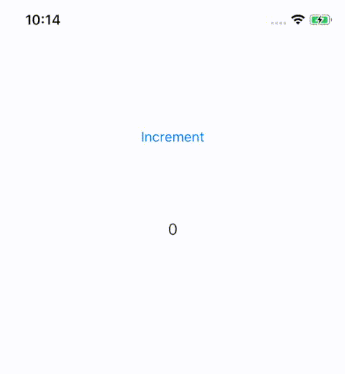

# Gluon

## Declarative UI framework written in pure Swift inspired by React

[](https://travis-ci.org/MaxDesiatov/Gluon)
[](https://cocoapods.org/pods/Gluon)
[](https://cocoapods.org/pods/Gluon)
[](https://cocoapods.org/pods/Gluon)
[](https://codecov.io/gh/maxdesiatov/Gluon)

### Easily build React-like UI components in Swift for new or existing iOS apps 🛠⚛️📲

Gluon provides a declarative, testable and scalable API for building UI
components backed by fully native views. It can be easily added to existing iOS
apps and you can start using Gluon for new app features without rewriting the
rest of the code or changing the app's overall architecture.

## Example code

Gluon recreates [React's Hooks
API](https://reactjs.org/docs/hooks-intro.html) improving it with Swift's strong
type system, high performance and efficient memory management thanks to being
compiled to a native binary.

An example of a Gluon component that binds a button to a label, embedded
within an existing UIKit app, looks like this:



```swift
struct Counter: LeafComponent {
  struct Props: Equatable {
    let frame: Rectangle
    let initial: Int
  }

  static func render(props: Props, hooks: Hooks) -> AnyNode {
    let count = hooks.state(props.initial)

    return StackView.node(.init(axis: .vertical,
                                distribution: .fillEqually,
                                Style(.frame(props.frame))), [
        Button.node(.init(onPress: Handler { count.set { $0 + 1 } }),
                    "Increment"),

        Label.node(.init(alignment: .center), "\(count.value)"),
    ])
  }
}


final class GluonViewController: UIViewController {
  private var renderer: UIKitRenderer?

  override func viewDidLoad() {
    super.viewDidLoad()

    // easy integration with any existing UIKit app!
    renderer = UIKitRenderer(
      Counter.node(.init(frame: Rectangle(view.frame), initial: 0)),
      rootViewController: self
    )
  }
}
```

## Fundamental concepts

Gluon's API builds upon only a few core concepts:

### Props

`Props` describe a "configuration" of what you'd like to see on user's screen.
`Props` are immutable and
[`Equatable`](https://developer.apple.com/documentation/swift/equatable), which
allows us to observe when they change. You wouldn't ever need to provide your
own `Equatable` implementation for `Props` as Swift compiler is able to generate
one for you [automatically behind the
scenes](https://github.com/apple/swift-evolution/blob/master/proposals/0185-synthesize-equatable-hashable.md).
Here's a simple `Props` struct you could use for your own component like
`Counter` from the example above:

```swift
struct Props: Equatable {
  let initial: Int
}
```

### Children

Sometimes "configuration" is described in a tree-like fashion. For example, a
list of views needs to be initialized with an array of subviews, which
themselves can contain other subviews. In Gluon this is called `Children`, which
behave similar to `Props`, but are important enough to be treated separately.
`Children` are also immutable and `Equatable`, which allows us to observe those
for changes too.

### Nodes

A node is a container for `Props`, `Children` and a type of a component
rendering this "configuration". If you're familiar with React, nodes in Gluon
correspond to [elements in
React](https://reactjs.org/docs/glossary.html#elements). When `Children` is an
array of nodes, we can indirectly form a tree of nodes, describing the app's UI.
Corollary, nodes are immutable and `Equatable`. You'd only need to use the
standard `AnyNode` type provided by Gluon:

```swift
struct AnyNode: Equatable {
  // ... `Props` and `Children` stored here by Gluon as private properties 
}
```
 
Here's an example of an array of nodes used as `Children` in a standard
`StackView` component provided by Gluon, which describe subviews of the stack
view.

```swift
struct StackView: Component {
  struct Props: Equatable {
    // ...
  }
  typealias Children = [AnyNode]
}
```

### Components

A component is a type, which describes how to render given `Props` and 
`Children` on screen:

```swift
protocol Component {
  associatedtype Props: Equatable
  associatedtype Children: Equatable
}
```

(Don't worry if you don't know what `associatedtype` means, it's only a simple
requirement for components to provide these types and make them `Equatable`. If
you do know what a [PAT](https://www.youtube.com/watch?v=XWoNjiSPqI8) is, you
also shouldn't worry. 😄 Gluon's API is built specifically to hide "sharp edges"
of PATs from the public API and to make it easy to use without requiring
advanced knowledge of Swift. This is similar to what [Swift standard
library](https://developer.apple.com/documentation/swift/swift_standard_library/)
has done, which is built on top of PATs but stays flexible and ergonomic).

For every component Gluon provides an easy way to create a node for it 
coupled with given props and children:

```swift
// this extension and its `node` function are defined for you by Gluon
extension Component {
  static func node(_ props: Props, _ children: Children) -> AnyNode {
    // ...
  }
}
```

One of the most simple components is a [pure
function](https://en.wikipedia.org/wiki/Pure_function) taking `Props` and
`Children` as an argument and returning a node tree as a result:

```swift
protocol PureComponent: Component {
  // this is the function you define for your own components, 
  // Gluon takes care of the rest
  static func render(props: Props, children: Children) -> AnyNode
}
```

Gluon calls `render` on your components when their `Props` or `Children` passed
from parent components change. You don't ever need to call `render` yourself,
pass different values as props or children to nodes returned from parent
`render` and Gluon will update only those views on screen that need to be
updated. 

Note that `render` function does not return *other components*, it returns
*nodes* that *describe other components*. It's a very important distiction,
which allows Gluon to stay efficient and to avoid updating deep trees of
components.

Some of your components wouldn't need `Children` at all, for those Gluon
provides a `PureLeafComponent` helper protocol that allows you to implement only
a single function with a simpler signature:

```swift
// Helpers provided by Gluon:

struct Null: Equatable {}

protocol PureLeafComponent: PureComponent where Children == Null {
  static func render(props: Props) -> AnyNode
}

extension PureLeafComponent {
  static func render(props: Props, children: Children) -> AnyNode {
    return render(props: props)
  }
}
```

### Hooks

Quite frequently you need components that are stateful or cause some other
[side effects](https://en.wikipedia.org/wiki/Side_effect_(computer_science)).
`Hooks` provide a clear separation between declarative components and other 
imperative code, such as state management, file I/O, networking etc.

The standard protocol `CompositeComponent` in Gluon gets `Hooks` injected into
`render` function as an argument.

```swift
protocol CompositeComponent: Component {
  static func render(
    props: Props,
    children: Children,
    hooks: Hooks
  ) -> AnyNode
}
```

In fact, standard `PureComponent` is a special case of a `CompositeComponent`
that doesn't use `Hooks` during rendering:

```swift
protocol PureComponent: CompositeComponent {
  static func render(props: Props, children: Children) -> AnyNode
}

extension PureComponent {
  static func render(
    props: Props,
    children: Children,
    hooks: Hooks
  ) -> AnyNode {
    return render(props: props, children: children)
  }
}
```

One of the simplest hooks is `state`. It allows a component to have its own
state and to be updated when the state changes. We've seen it used in the
`Counter` example:

```swift
struct Counter: LeafComponent {
  // ...
  static func render(props: Props, hooks: Hooks) -> AnyNode {
    let count = hooks.state(0)
    // ...
  }
```

It returns a very simple state container, which on initial call of `render`
contains `0` as a value and values passed to `count.set(_: Int)` on subsequent
updates:

```swift
struct State<T> {
  let value: T

  // set the state to a value you already have
  func set(_ value: T)

  // or set the state with a pure function
  func set(_ updater: (T) -> T)
}
```

Note that `set` functions are not `mutating`, they never update the component's
state in-place synchronously, but only schedule an update with Gluon at a later
time. A call to `render` is only scheduled on the component that obtained this
state with `hooks.state`. 

When you need state changes to update any of the descendant components, you can
pass the state value within props or children of nodes returned from `render`.
In `Counter` component the label's content is "bound" to `count` this way:

```swift
struct Counter: LeafComponent {
  // ...
  static func render(props: Props, hooks: Hooks) -> AnyNode {
    let count = hooks.state(props.initial)

    return StackView.node(
      // ...
      [
        Button.node(.init(onPress: Handler { count.set { $0 + 1 } }), 
          "Increment"),
        Label.node(.init(alignment: .center), "\(count.value)"),
      ]
    )
  }
}
```

Hooks provide a great way to compose side effects and also to keep them separate
from your component code. You can always create your own hook reusing existing
ones: just add it to your `extension Hooks` wherever works best for you.

### Renderers

When mapping Gluon's architecture to what's previosly been established in iOS,
components correspond to a "view-model" layer, while hooks provide a reusable
"controller" layer. A `Renderer` is "view" layer in these terms, but it's fully
managed by Gluon. Not only this greatly simplifies your code of your components
and allows you to make it declarative, it also completely decouples
platform-specific code. 

Note that `Counter` component above didn't contain a single `UIKit` type,
although it's then passed to a specific `UIKitRenderer`. Providing renderers for
other platforms in the future is one of our top priorities. Imagine an
`AppKitRenderer` that allows you to render the same component on macOS without
any changes applied to the component code and without requiring Marzipan!

## Example project

To run the example project, clone the repo, and run `pod install` from the
[`Example`](https://github.com/MaxDesiatov/Gluon/tree/master/Example) directory
first.

## Requirements

* iOS 10.0
* Xcode 10.1
* Swift 4.2

<!--

## Installation

### CocoaPods

[CocoaPods](https://cocoapods.org) is a dependency manager for Swift and
Objective-C Cocoa projects. You can install it with the following command:

```bash
$ gem install cocoapods
```

Navigate to the project directory and create `Podfile` with the following command:

```bash
$ pod install
```

Inside of your `Podfile`, specify the `Gluon` pod:

```ruby
# Uncomment the next line to define a global platform for your project
# platform :ios, '9.0'

target 'YourApp' do
  # Comment the next line if you're not using Swift and don't want to use dynamic frameworks
  use_frameworks!

  # Pods for Test
  pod 'Gluon', '~> 0.1'
end
```

Then, run the following command:

```bash
$ pod install
```

Open the the `YourApp.xcworkspace` file that was created. This should be the
file you use everyday to create your app, instead of the `YourApp.xcodeproj`
file.

-->

## FAQ

### Why does Gluon use value types and protocols instead of classes?

Swift developers focused on GUI might be used to classes thanks to abundance of
class hierarchies in `UIKit` and `AppKit` (although [benefits of composition
over
inheritance](https://developer.apple.com/library/archive/documentation/Cocoa/Conceptual/CocoaFundamentals/AddingBehaviortoaCocoaProgram/AddingBehaviorCocoa.html#//apple_ref/doc/uid/TP40002974-CH5-SW22)
were previously highlighted by Apple). Unfortunately, while `UIKit` is a
relatively fresh development, it still closely follows many patterns used in
`AppKit`, which was itself [built in late
80s](https://en.wikipedia.org/wiki/NeXTSTEP). Both of these were developed with
Objective-C in mind, years before Swift became public and [protocol-oriented
patterns](https://developer.apple.com/videos/play/wwdc2015/408/) were
established.

One of the main goals of Gluon is to build a UI framework that feels native to
Swift. Gluon's API brings these benefits when compared to class-based APIs:

- no need to [subclass `NSObject` to conform to commonly used
  protocols](https://stackoverflow.com/questions/31754366/swift-my-custom-uitableviewdatasource-class-thinks-it-doesnt-conform-to-protoc);
- no need to use `override` and to remember to call `super`;
- no need for `required init`, `convenience init` or to be concerned with strict
  class initialization rules;
- you can't create a reference cycle with immutable values, no need for
  [`weakSelf/strongSelf`
  dance](https://stackoverflow.com/questions/21113963/is-the-weakself-strongself-dance-really-necessary-when-referencing-self-inside-a)
  when using callbacks;
- you don't need to worry about modifying an object in a different scope
  captured with a reference by accident: immutable values are implicitly copied
  and most of the copies are removed by the compiler during optimization;
- focus on composition over inheritance: no need to subclass `UIViewController`
  or `UIView` and to worry about all of the above when you only need simple 
  customization;
- focus on functional and declarative programming, while still allowing to use
  imperative code when needed: value types guarantee lack of unexpected
  side effects in pure functions.

### Is there anything like [JSX](https://reactjs.org/docs/jsx-in-depth.html) available for Gluon?

At the moment the answer is no, but we find that Gluon's API allows you to
create nodes much more concisely when compared to `React.createElement` syntax.
In fact, with Gluon's `node` API you don't need closing element tags you'd have 
to write with JSX. E.g. compare this:

```swift
Label.node("label!")
```

to this:

```jsx
<Label>label!</Label>
```

We do agree that there's an overhead of `.init` for props and a requirement of
props initializer arguments to be ordered. For the latter, we have a helpful
convention in Gluon that all arguments to props initializers should be ordered
alphabetically.

The main problem is that currently there's no easily extensible Swift parser or
a macro system available that would allow something like JSX to be used for
Gluon. As soon is it becomes easy to implement, we'd definitely consider it as
an option.

## Author

[Max Desiatov](https://desiatov.com)

## License

Gluon is available under the Apache 2.0 license. See the
[LICENSE](https://github.com/MaxDesiatov/Gluon/blob/master/LICENSE) file for
more info.

## Contributing

This project adheres to the [Contributor Covenant Code of
Conduct](https://github.com/MaxDesiatov/Gluon/blob/master/CODE_OF_CONDUCT.md).
By participating, you are expected to uphold this code. Please report
unacceptable behavior to conduct@gluon.sh.
