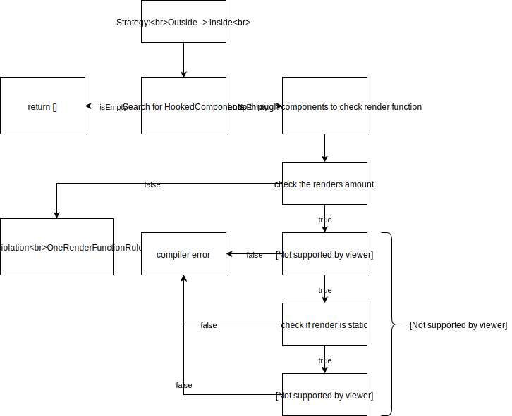

## Tokamak Linter

Tokamak Linter is a module to check your Tokamak projects for known warnings
and show them in Xcode or in terminal.

## How to run

### Add to Xcode build phase

- build TokamakCLI target with Xcode
- add path to `tokamak` executable to build phase

```bash
{path to TokamakCLI}/tokamak lint {path to folder or file}
```

or

### Run in terminal

- run `swift build --product tokamak` in Tokamak directory
- run `swift run tokamak lint "{path to lint folder or file}"` in Tokamak directory

### TokamakCLI options

Log file path can be added to command after path to lint content via `-l` or `--log-file` flag as in example:
`swift run tokamak lint "{path to lint folder or file}" -l "/Users/usr/Documents/lint.log"`

## Supported Rules

| Rule                | Short Description                                      |
| ------------------- | ------------------------------------------------------ |
| Props conformance   | Props should be always conformance Equatable protocol. |
| One render function | Hooked component should have only one render function. |

## Rules Description

### One render function


